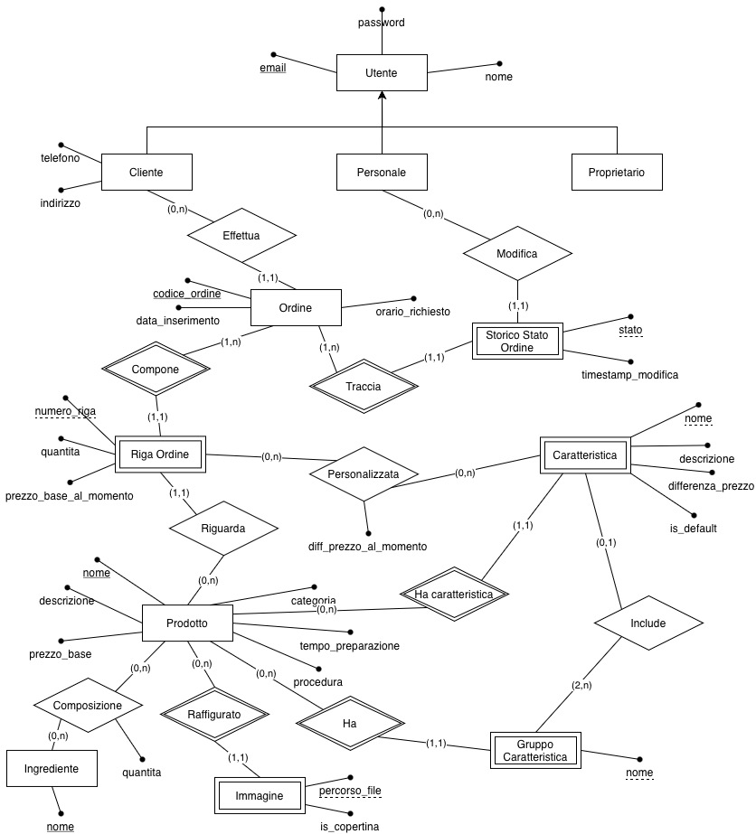
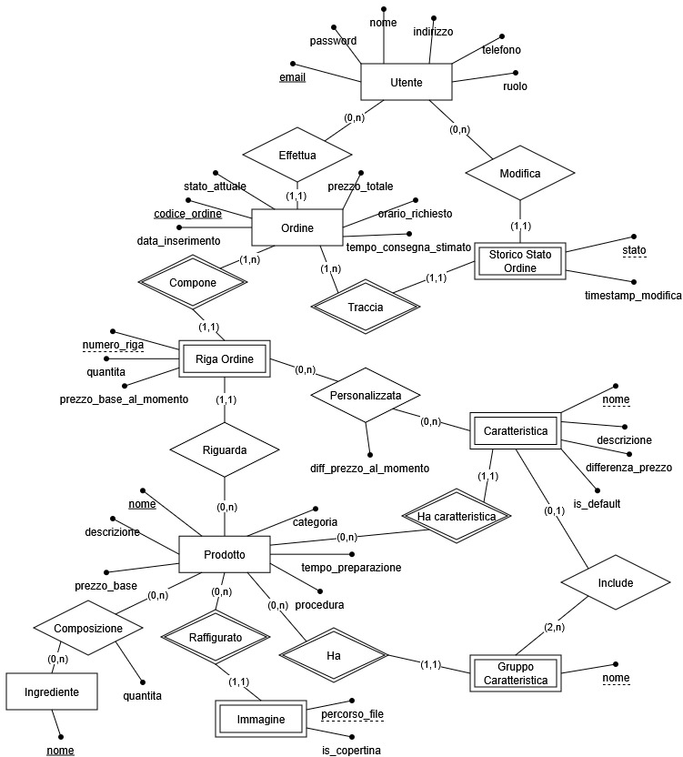

# Laboratorio di Basi di Dati:  *Progetto "Delivery"*

**Gruppo di lavoro**:

| Matricola | Nome | Cognome | Contributo al progetto |
|:---------:|:----:|:-------:|:----------------------:|
|295438|Alessia|De Dominicis|                        |
|271770|Riccardo|D'Aviero|                        |

**Data di consegna del progetto**: 02/09/2026


---

## Indice 

1. [Formalizzazione ed analisi dei requisiti](#1-formalizzazione-ed-analisi-dei-requisiti)

   1.1 [Specifiche del progetto](#11-specifiche-del-progetto)

   1.2 [Scelte Progettuali e Risoluzione delle Ambiguità](#12-scelte-progettuali-e-risoluzione-delle-ambiguità)

2. [Progettazione concettuale](#2-progettazione-concettuale)

    2.1 [Modello Entità-Relazione](#21-modello-entità-relazione)

   2.2 [Formalizzazione dei vincoli non esprimibili nel modello ER](#22-formalizzazione-dei-vincoli-non-esprimibili-nel-modello-er)

3. [Progettazione logica](#3-progettazione-logica)

   3.1 [Ristrutturazione ed ottimizzazione del modello ER](#31-ristrutturazione-ed-ottimizzazione-del-modello-er)

   3.2 [Traduzione del modello ER nel modello relazionale](#32-traduzione-del-modello-er-nel-modello-relazionale)

4. [Progettazione fisica](#4-progettazione-fisica)

   4.1 [Implementazione del modello relazionale](#41-implementazione-del-modello-relazionale)

   4.2 [Implementazione dei vincoli](#42-implementazione-dei-vincoli)

   4.3 [Implementazione funzionalità richieste](#43-implementazione-funzionalità-richieste)

---

##  1. Formalizzazione ed analisi dei requisiti

### 1.1 Specifiche del progetto

#### Descrizione del dominio
Il database *Delivery* supporta una generica attività di ristorazione che offre servizio di consegna a domicilio.

L'attività disporrà di un *menu* composto da *prodotti* ognuno dotato almeno di un nome, una descrizione, un prezzo e, opzionalmente, una (o più) immagini. Internamente (cioè in modo non visibile ai clienti), ogni prodotto avrà anche associati un tempo di preparazione, una lista di ingredienti (con quantità) e opzionalmente la descrizione testuale della procedura di preparazione. Deve essere prevista anche la possibilità di scegliere tra differenti *caratteristiche* del prodotto, ognuna dotata di nome, descrizione (opzionale) e di differenza prezzo (rispetto al prezzo base del prodotto). Alcune caratteristiche potranno essere di *default* (quindi pre-selezionate). Infine,si potranno creare *gruppi di mutua esclusione* tra sottoinsiemi delle caratteristiche (in modo che solo una delle caratteristiche nel gruppo possa essere selezionata). *Esempio: il prodotto "caffè" potrebbe costare 1 euro, e avere come caratteristiche "senza zucchero" (-5 centesimi), "zuccherato" (default) e "molto zuccherato", raggruppate in un gruppo di mutua esclusione chiamato "zucchero", oltre a "con panna" (+50 centesimi) e "freddo" (+1 euro), liberamente selezionabili (non raggruppate).*

I *clienti* potranno registrarsi liberamente nel sistema, ma si noti che i dati di un cliente dovranno necessariamente comprendere contatti telefonici e indirizzo, visto che parliamo di consegna a domicilio.

I clienti potranno selezionare uno o più prodotti dal menu, comprensivi di caratteristiche se presenti, creando un *ordine* a loro nome. L'utente potrà quindi confermare o annullare l'ordine. In caso di conferma, l'utente potrà anche selezionare un orario specifico per la consegna. 

L'applicazione avrà anche altre due tipologie di utenti: il *proprietario*, che supponiamo pre-caricato nel sistema all'atto della sua installazione, e il *personale*. Il primo potrà monitorare gli ordini passati, in preparazione ed evasi, potrà comporre il menu inserendo o modificando tutte le informazioni inerenti i prodotti e potrà infine registrare membri del personale.

I membri del personale vedranno la lista degli ordini correnti, che potranno avere cinque stati: *inserito*, *in preparazione*, *pronto*, *in consegna* e *consegnato*. Il personale potrà cambiare lo stato dell'ordine in qualsiasi momento, ma solo seguendo l'ordine progressivo (non si potrà riportare un ordine in consegna nello stato di preparazione). Il sistema dovrà tener traccia dell'effettivo membro del personale che effettua ciascun cambio di stato su un ordine.

#### Operazioni da realizzare

Di seguito sono illustrate schematicamente le operazioni
previste sulla base di dati, ciascuna da realizzare tramite una query (o, se
necessario, tramite più query, *opzionalmente* racchiuse in una *stored
procedure*). Ovviamente, ogni ulteriore raffinamento o arricchimento di
queste specifiche aumenterà il valore del progetto.


1. Generazione del menu (*lista dei prodotti con tutte le informazioni visibili al cliente, possibilmente anche le relative caratteristiche con la differenza di prezzo*).

2. Eliminazione di una caratteristica associata a un prodotto.

3. Inserimento di un prodotto in un ordine, comprensivo delle sue eventuali caratteristiche.

4. Calcolo del tempo stimato di consegna e del prezzo totale di un ordine (*suggerimento: potete provare a usare una sotto-query per calcolare la differenza cumulativa di prezzo derivante dalle caratteristiche selezionate e poi sommarla al prezzo base*).

5. Lista degli ordini non ancora messi in preparazione dopo più di un'ora dall'inserimento (*suggerimento: è quindi necessario prevedere degli opportuni timestamp da affiancare agli stati*). 

6. Calcolo del tempo medio di consegna, cioè di passaggio tra lo stato *in consegna* in quello *consegnato*, per ciascun membro del personale addetto alla consegna (*supponiamo che chi consegna sia colui il quale imposta lo stato su consegnato*).

7. Classifica di gradimento dei prodotti (*quali prodotti compaiono più comunemente negli ordini?*).

8. Calcolo dell'incasso giornaliero.

9. Prospetto del consumo di ingredienti in un anno (*quantità di ciascun ingrediente consumata in un certo anno*).

10. Estrazione dei prodotti preferiti da un cliente (*cioè i prodotti più ordinati da quel cliente, magari escludendo a priori quelli ordinati solo un paio di volte...*).

11. Conteggio degli ordini attivi (non in stato *consegnato*) divisi per il loro stato di avanzamento.

12. Conteggio degli ordini smaltiti (consegnati) in uno specifico giorno.

13. Lista dei membri del personale che hanno lavorato a un particolare ordine.

14. Aggiornamento dello stato di un ordine.

### 1.2 Scelte Progettuali e Risoluzione delle Ambiguità

Durante l'analisi della specifica, sono emerse alcune ambiguità o necessità di raffinamento del dominio, che sono state risolte come segue: 

- **Gestione dello storico prezzi**: Lo storico ordini dovrebbe riportare come prezzo totale di un ordine effettuato il prezzo effettivo pagato dal cliente al momento della conferma, e non dovrebbe ricalcolarlo in base al prezzo attuale dei prodotti: il proprietario potrebbe modificare i prezzi di un prodotto e ciò poi modificherebbe retroattivamente il prezzo totale anche di tutti gli ordini passati che contenevano quel prodotto. Abbiamo, quindi, scelto di storicizzare il prezzo con gli attributi ```prezzo_base_al_momento``` e ```diff_prezzo_al_momento``` legati direttamente alla fase di composizione dell'ordine.

- **Identificazione univoca degli ordini**: Inizialmente si era valutato di identificare un ordine tramite la data e ora di inserimento combinata all'identificativo del cliente. Tuttavia potrebbe crearsi la situazione in cui un utente effettua due ordini nello stesso "istante", magari potrebbe effettuare due ordini nell'arco di un minuto e il sistema potrebbe non aggiornare l'orario, o per problemi di rete. Per prevenire eventuali conflitti, abbiamo scelto di modellare l'ordine come entità forte, identificata da un codice di ordine univoco, che potrebbe essere banalmente il codice sulla ricevuta.

- **Tracciamento dei cambi di stato**: Per soddisfare il requisito di tener traccia di quale membro del personale effettua ciascun cambio di stato, si è introdotta l'entità debole Storico Stato Ordine. La chiave parziale scelta è l'attributo stato: questa scelta è giustificata dal fatto che la specifica impone un avanzamento rigorosamente progressivo e non ciclico degli stati ("non si potrà riportare un ordine in consegna nello stato di preparazione"), garantendo quindi che uno stesso stato non si ripeta mai due volte per lo stesso ordine. 
Inoltre, il tracciamento del membro del personale responsabile di ogni cambio di stato riguarda solo le transizioni da "inserito" in poi perché i membri del personale non inseriscono gli ordini, bensì è il cliente. La creazione dell'ordine viene quindi tracciata separatamente con un timestamp di inserimento sull'ordine stesso (```data_inserimento```), invece dello storico degli stati.

- **Caratteristiche non raggruppate**: La specifica prevede esplicitamente caratteristiche "liberamente selezionabili (non raggruppate)" accanto a quelle organizzate in gruppi di mutua esclusione. Abbiamo quindi modellato il legame Prodotto–Caratteristica come relazione diretta e obbligatoria, mentre l'appartenenza a un Gruppo di mutua esclusione è stata modellata come opzionale per la singola caratteristica.

- **Numero minimo di caratteristiche per gruppo**: Abbiamo deciso di vincolare la relazione Include tra Gruppo Caratteristica e Caratteristica con cardinalità (2,n) sul lato Gruppo Caratteristica. Abbiamo deciso ciò perché un gruppo di mutua esclusione ha senso solo se permette di scegliere tra almeno due opzioni. 

- **Dati obbligatori del cliente**: La specifica impone che un cliente debba necessariamente inserire numero di telefono e indirizzo per la consegna, questo vincolo vale però solo per i clienti e non per i membri del personale e il proprietario che non hanno bisogno di inserire questi dati. Abbiamo modellato questi dati come attributi specifici di Cliente e non di Utente.

- **Relazione proprietario–personale**: Abbiamo scelto di non modellare esplicitamente un legame tra Proprietario e i membri del Personale da lui registrati: la relazione tra i membri del personale e il proprietario sarebbe sempre la stessa, essendoci (da specifica) un unico proprietario è quindi scontato che l'inserimento lo effettui sempre lui. Se avessimo invece deciso di tenere traccia di più proprietari, avrebbe avuto senso introdurre questa relazione per tenere traccia di quale proprietario avesse inserito un determinato membro del personale.

- **Gestione immagini multiple**: Per associare un'immagine ad un prodotto, avevamo pensato di includere un semplice attributo ```percorso_immagine``` a Prodotto, ma la specifica dice che un prodotto potrebbe avere anche più di un'immagine associata ad esso. Abbiamo deciso quindi di creare l'entità debole Immagine che contiene ```percorso_file``` e ```is_copertina```. Per quanto il percorso del file potrebbe univocamente identificare un'immagine, abbiamo deciso di non modellarla come entità forte perché non avrebbe senso memorizzare immagini se esse non sono associate ad un prodotto.

- **Calcolo del tempo stimato di consegna**: Per quanto riguarda il calcolo del tempo di preparazione di un ordine, assumiamo che la cucina del locale possa preparare più prodotti in contemporanea. Quindi, il tempo di preparazione dell'ordine sarà il tempo di preparazione del prodotto più lento, a cui andrà aggiunto un tempo fisso stimato per il tragitto di consegna, e non la somma dei tempi dei singoli prodotti.

## 2. Progettazione concettuale

###  2.1 Modello Entità-Relazione


>Diagramma realizzato con draw.io

#### Descrizione entità
- **Utente**: Entità padre di Cliente, Personale, Proprietario, rappresenta chiunque interagisca col sistema. Identificato univocamente dalla propria email.

- **Prodotto**: Elemento del menu acquistabile dal cliente. Possiede un prezzo base e una descrizione pubblici e dettagli interni per la preparazione (tempo, procedura, ingredienti). Identificato univocamente dal suo nome (realisticamente un ristorante non avrà dei prodotti chiamati allo stesso modo).

- **Ingrediente**: Materia prima necessaria per la composizione di un prodotto. Identificato  uivocamente dal suo nome.

- **Caratteristica**: Variazione o opzione applicabile a un prodotto. Può comportare un sovrapprezzo o uno sconto rispetto al prezzo base. Una caratteristica può essere di default (```is_default```). Identificata univocamente dal suo nome e dal prodotto che la contiene.

- **Gruppo Caratteristica**: Insieme di caratteristiche per le quali vale la regola della mutua esclusione (all'interno del gruppo, è possibile selezionare al massimo una singola opzione per prodotto). Identificato univocamente dal suo nome e dal prodotto che lo contiene.

- **Ordine**: Richiesta di acquisto effettuata da un cliente. Comprende l'orario di consegna richiesto e segue un ciclo di vita a stati (inserito, in preparazione, pronto, in consegna, consegnato). Identificato univocamente dal suo codice di ordine. 

- **Storico Stato Ordine**: Ci permette di tenere traccia dello storico degli ordini. Identificato univocamente dall'ordine e dallo stato ad associato ad esso (mai ripetuto per lo stesso ordine).

- **Riga Ordine**: Singola voce all'interno di un ordine, che isola un prodotto specifico, la sua quantità e le esatte caratteristiche scelte dal cliente per quella specifica istanza. Identificato univocamente da un numero di riga (l'utente potrebbe aggiungere all'ordine due volte lo stesso prodotto, con la stessa quantità e le stesse modifiche).

- **Immagine**: Entità inserita per permettere ad un prodotto di avere più immagini. Un'immagine potrebbe essere indicata come quella da usare in copertina (```is_copertina```). Identificato univocamente dal percorso del file e dal prodotto a cui è associata.


### 2.2 Formalizzazione dei vincoli non esprimibili nel modello ER
 
1. **Progressione obbligata dello stato dell'ordine.**
Il personale può cambiare lo stato di un ordine solo seguendo l'ordine *inserito -> in preparazione -> pronto -> in consegna -> consegnato*, senza possibilità di tornare a uno stato precedente e senza poter saltare stati intermedi. Ogni nuovo inserimento in Storico Stato Ordine deve quindi riferirsi allo stato immediatamente successivo a quello più recente registrato per lo stesso ordine.

2. **Coerenza temporale dello storico stati.**
Il `timestamp_modifica` di ogni nuova riga di Storico Stato Ordine relativa a un dato ordine deve essere maggiore di tutti i `timestamp_modifica` già registrati per lo stesso ordine, e successivo a `data_inserimento` dell'ordine stesso.

3. **Unicità della caratteristica di default per gruppo.**
All'interno di uno stesso Gruppo Caratteristica, al più una caratteristica può avere `is_default = true` e questa deve essere selezionata implicitamente se non viene selezionata un'altra caratteristica.

4. **Mutua esclusione in fase di selezione ordine.**
In una stessa Riga Ordine, tra le caratteristiche selezionate tramite Personalizzata non possono comparirne due appartenenti allo stesso Gruppo Caratteristica.
   
5. **Coerenza tra prezzo congelato e prezzo di listino al momento dell'ordine.**
`prezzo_base_al_momento` (su Riga Ordine) e `diff_prezzo_al_momento` (su Personalizzata) devono corrispondere ai valori di `prezzo_base` e `differenza_prezzo` effettivamente in vigore su Prodotto/Caratteristica nell'istante di creazione dell'ordine.

6. **Non negatività di importi e quantità.**
`prezzo_base`, `differenza_prezzo`, `quantità`, `prezzo_base_al_momento` non possono assumere valori negativi e `tempo_preparazione` deve essere maggiore di zero.

7. **Orario di consegna richiesto coerente.**
Se specificato dal Cliente, l'`orario_richiesto` per un Ordine deve essere successivo a `data_inserimento` + `tempo_consegna_stimato`, la cucina deve avere il tempo di prepararlo e consegnarlo.  

8. **Unicità del ruolo per il Proprietario.**
Il Proprietario deve essere unico nel sistema (pre-caricato all'installazione).

9. **Congruenza del flag `is_copertina`.**
Per ogni Prodotto che ha almeno un'immagine, tra le immagini associate solo una può avere `is_copertina = true`.

10. **Selezione caratteristiche valide.** 
Un ordine può essere personalizzato solo con caratteristiche che sono effettivamente associate al prodotto di quella riga.

---

## 3. Progettazione logica

### 3.1 Ristrutturazione ed ottimizzazione del modello ER

#### Diagramma ER ristrutturato


>Diagramma realizzato con draw.io

#### Modifiche apportate 
TODO: sistemare i diagrammi

**Eliminazione della generalizzazione Utente**
Il primo modello ER presentava una generalizzazione in cui Utente è entità padre di Cliente, Personale, Proprietario. Analizzando le sottocalissi, abbiamo notato che solo Cliente possiede degli alttributi specifici (`telefono` e `indirizzo`) mentre Personale e Proprietario non ne hanno, entrambi ereditano direttamente gli attributi di Utente. Inoltre abbiamo riflettuto sulla logica di login, che deve essere uguale per ogni tipo di Utente indipendentemente dal ruolo, e se dividessimo le sottoclassi in tre entità distinte, il login diventerebbe molto complicato. Infatti invece di effettuare un'unica query su un'unica tabella, si dovrebbero interrogare tre tabelle diverse o sapere già prima autenticazione a quale ruolo appartiene l'utente.

Abbiamo, quindi, scelto di risolvere questa gerarchia facendo una fusione dal basso verso l'alto (figli-genitore) accorpando quindi le sottoclassi nella superclasse. Adesso abbiamo un'unica entità Utente a cui aggiungiamo un attributo discriminante `ruolo` (che potrà essere "cliente", "personale" o "proprietario"). I due attributi inizialmente esclusivi di Cliente `telefono` e `indirizzo`, verrano resi opzionali per Personale e Proprietario e obbligatori solo per Cliente. Un Ordine può essere collegato solo a un Utente con ruolo = 'cliente'" e "una riga di Storico Stato Ordine può essere collegata solo a un Utente con ruolo = 'personale'". 

**Introduzione di ridondanze controllate**
Per ottimizzare il database e snellire le operazioni di lettura, abbiamo deciso di aggiungere delle ridondanze controllate a Ordine che avevamo rimosso nel modello concettuale:

- `stato_attuale`, sarebbe lo `stato` in Storico Stato Ordine più recente associato a un determinato Ordine. Utile per la visualizzazione degli ordini attivi per il personale. Viene aggiornato da un Trigger ogni volta che viene inserito un nuovo `stato` in Storico Stato Ordine, ovvero un membro del personale modifica lo stato di un ordine, piuttosto che ricavarlo ogni volta.
Si dovrebbe fare ogni volta una JOIN con Storico Stato Ordine e cercare il MAX(timestamp_modifica) per ricavarlo.

- `prezzo_totale`, sarebbe la somma di tutti i prezzi base dei prodotti inlcusi in un Ordine, moltiplicati per le quantità selezionate e con eventuale aggiunta della differenza di prezzo per la personalizzazione.
invece di ricalcolarlo ogni volta, viene aggiornato da un trigger al momento della conferma di un ordine da parte del cliente. 
Utile anche per alleggerire il calcolo delle statistiche. 

- `tempo_consegna_stimato`, sarebbe il tempo di preparazione più lungo di tutti i prodotti di un ordine, sommato ad un tempo di tragitto standard. Invece di ricavarlo ogni volta, conviene salvarlo una sola volta dato che è solo una stima visibile al cliente al momento della conferma di un ordine e non un dato che deve essere aggiornato. Quindi verrà calcolato e salvato tramite un Trigger all'inserimento dei prodotti nella Riga_Ordine o tramite una procedura all'atto della conferma dell'ordine.

### 3.2 Traduzione del modello ER nel modello relazionale

Le <u>**chiavi primarie**</u> sono indicate in grassetto e sottolineate, le <u>chiavi esterne</u> sono solo sottolineate. I vincoli di unicità derivati dalle ex-chiavi primarie concettuali sono indicati dalla dicitura *UNIQUE*.

-   **Utente**(<u>**id_utente**</u>, email, password, nome, ruolo, telefono, indirizzo)
    -   Vincoli: email UNIQUE
-   **Ordine**(<u>**id_ordine**</u>, codice_ordine, <u>id_utente_cliente</u>, data_inserimento, orario_richiesto, stato_attuale, prezzo_totale, tempo_consegna_stimato)
    -   Vincoli: codice_ordine UNIQUE
    -   Chiavi esterne: id_utente_cliente (Utente)
-   **Storico_Stato**(<u>**id_storico**</u>, <u>id_ordine</u>, stato, <u>id_utente_personale</u>, timestamp_modifica)
    -    Vincoli: (id_ordine, stato) UNIQUE
    -    Chiavi esterne: id_ordine (Ordine); id_utente_personale (Utente)
-   **Prodotto**(<u>**id_prodotto**</u>, nome, descrizione, prezzo_base, categoria, tempo_preparazione, procedura)
    -   Vincoli: nome UNIQUE
-   **Immagine**(<u>**id_immagine**</u>, <u>id_prodotto</u>, percorso_file, is_copertina)
    -   Vincoli: (id_prodotto, percorso_file) UNIQUE
    -   Chiavi esterne: id_prodotto (Prodotto)
-   **Ingrediente**(<u>**id_ingrediente**</u>, nome)
    -   Vincoli: nome UNIQUE
-   **Composizione**(<u>**id_prodotto**</u>, <u>**id_ingrediente**</u>, quantita)
    -   Chiavi esterne: id_prodotto (Prodotto); id_ingrediente (Ingrediente)
-   **Gruppo_Caratteristica**(<u>**id_gruppo**</u>, <u>id_prodotto</u>, nome)
    -   Vincoli: (id_prodotto, nome) UNIQUE
    -   Chiavi esterne: id_prodotto (Prodotto)
-   **Caratteristica**(<u>**id_caratteristica**</u>, <u>id_prodotto</u>, <u>id_gruppo</u>, nome, descrizione, differenza_prezzo, is_default)
    -   Vincoli: (id_prodotto, nome) UNIQUE
    -   Chiavi Esterne: id_prodotto (Prodotto); id_gruppo (Gruppo_Caratteristica)
-   **Riga_Ordine**(<u>**id_riga**</u>, <u>id_ordine</u>, numero_riga, <u>id_prodotto</u>, quantita, prezzo_base_al_momento)
    -   Vincoli: (id_ordine, numero_riga) UNIQUE
    -   Chiavi Esterne: id_ordine (Ordine); id_prodotto (Prodotto)
-   **Personalizzata**(<u>**id_riga**</u>, <u>**id_caratteristica**</u>, diff_prezzo_al_momento)
    -   Chiavi Esterne: id_riga (Riga_Ordine); id_caratteristica (Caratteristica)

Tutte le chiavi esterne devono essere NOT NULL, ad eccezione di `id_gruppo` in Caratteristica che ammette anche NULL. 

## 4. Progettazione fisica

### 4.1 Implementazione del modello relazionale

- Inserite qui lo *script SQL* con cui **creare il database** il cui modello relazionale è stato illustrato nella sezione precedente. Ricordate di includere nel codice tutti i vincoli che possono essere espressi nel DDL. 

- Potete *opzionalmente* fornire anche uno script separato di popolamento (INSERT) del database su cui basare i test delle query descritte nella sezione successiva.

```sql
CREATE DATABASE IF NOT EXISTS Delivery;
USE Delivery;

DROP TABLE IF EXISTS Personalizzata;
DROP TABLE IF EXISTS Riga_Ordine;
DROP TABLE IF EXISTS Storico_Stato;
DROP TABLE IF EXISTS Ordine;
DROP TABLE IF EXISTS Caratteristica;
DROP TABLE IF EXISTS Gruppo_Caratteristica;
DROP TABLE IF EXISTS Immagine;
DROP TABLE IF EXISTS Composizione;
DROP TABLE IF EXISTS Ingrediente;
DROP TABLE IF EXISTS Prodotto;
DROP TABLE IF EXISTS Utente;

CREATE TABLE Utente (
    id_utente     INT AUTO_INCREMENT PRIMARY KEY,
    email         VARCHAR(255) NOT NULL,
    password      VARCHAR(255) NOT NULL,
    nome          VARCHAR(100) NOT NULL,
    ruolo         ENUM('cliente', 'personale', 'proprietario') NOT NULL,
    telefono      VARCHAR(20)  NULL,
    indirizzo     VARCHAR(255) NULL,
    CONSTRAINT uq_utente_email UNIQUE (email),
    -- telefono e indirizzo obbligatori solo per i clienti
    CONSTRAINT chk_utente_cliente_dati CHECK (
        ruolo <> 'cliente' OR (telefono IS NOT NULL AND indirizzo IS NOT NULL)
    )
);

CREATE TABLE Prodotto (
    id_prodotto       INT AUTO_INCREMENT PRIMARY KEY,
    nome              VARCHAR(100) NOT NULL,
    descrizione       TEXT NOT NULL,
    prezzo_base       DECIMAL(6,2) NOT NULL,
    categoria         VARCHAR(50) NULL,
    tempo_preparazione INT NOT NULL COMMENT 'minuti',
    procedura         TEXT NULL,
    CONSTRAINT uq_prodotto_nome UNIQUE (nome),
    CONSTRAINT chk_prodotto_prezzo CHECK (prezzo_base >= 0),
    CONSTRAINT chk_prodotto_tempo CHECK (tempo_preparazione > 0)
);

CREATE TABLE Ingrediente (
    id_ingrediente INT AUTO_INCREMENT PRIMARY KEY,
    nome           VARCHAR(100) NOT NULL,
    CONSTRAINT uq_ingrediente_nome UNIQUE (nome)
);

CREATE TABLE Composizione (
    id_prodotto    INT NOT NULL,
    id_ingrediente INT NOT NULL,
    quantita       DECIMAL(6,2) NOT NULL,
    PRIMARY KEY (id_prodotto, id_ingrediente),
    CONSTRAINT fk_composizione_prodotto FOREIGN KEY (id_prodotto)
        REFERENCES Prodotto(id_prodotto) ON DELETE CASCADE ON UPDATE CASCADE,
    CONSTRAINT fk_composizione_ingrediente FOREIGN KEY (id_ingrediente)
        REFERENCES Ingrediente(id_ingrediente) ON DELETE RESTRICT ON UPDATE CASCADE,
    CONSTRAINT chk_composizione_quantita CHECK (quantita > 0)
);

CREATE TABLE Immagine (
    id_immagine   INT AUTO_INCREMENT PRIMARY KEY,
    id_prodotto   INT NOT NULL,
    percorso_file VARCHAR(255) NOT NULL,
    is_copertina  BOOLEAN NOT NULL DEFAULT FALSE,
    CONSTRAINT uq_immagine_percorso UNIQUE (id_prodotto, percorso_file),
    CONSTRAINT fk_immagine_prodotto FOREIGN KEY (id_prodotto)
        REFERENCES Prodotto(id_prodotto) ON DELETE CASCADE ON UPDATE CASCADE
);

CREATE TABLE Gruppo_Caratteristica (
    id_gruppo   INT AUTO_INCREMENT PRIMARY KEY,
    id_prodotto INT NOT NULL,
    nome        VARCHAR(100) NOT NULL,
    CONSTRAINT uq_gruppo_prodotto_nome UNIQUE (id_prodotto, nome),
    CONSTRAINT fk_gruppo_prodotto FOREIGN KEY (id_prodotto)
        REFERENCES Prodotto(id_prodotto) ON DELETE CASCADE ON UPDATE CASCADE
);

CREATE TABLE Caratteristica (
    id_caratteristica INT AUTO_INCREMENT PRIMARY KEY,
    id_prodotto        INT NOT NULL,
    id_gruppo          INT NULL,
    nome               VARCHAR(100) NOT NULL,
    descrizione        TEXT NULL,
    differenza_prezzo  DECIMAL(6,2) NOT NULL DEFAULT 0,
    is_default         BOOLEAN NOT NULL DEFAULT FALSE,
    CONSTRAINT uq_caratteristica_prodotto_nome UNIQUE (id_prodotto, nome),
    CONSTRAINT fk_caratteristica_prodotto FOREIGN KEY (id_prodotto)
        REFERENCES Prodotto(id_prodotto) ON DELETE CASCADE ON UPDATE CASCADE,
    CONSTRAINT fk_caratteristica_gruppo FOREIGN KEY (id_gruppo)
        REFERENCES Gruppo_Caratteristica(id_gruppo) ON DELETE SET NULL ON UPDATE CASCADE
);

CREATE TABLE Ordine (
    id_ordine            INT AUTO_INCREMENT PRIMARY KEY,
    codice_ordine         VARCHAR(30) NOT NULL,
    id_utente_cliente     INT NOT NULL,
    data_inserimento      DATETIME NOT NULL DEFAULT CURRENT_TIMESTAMP,
    orario_richiesto      DATETIME NULL,
    stato_attuale         ENUM('inserito','in preparazione','pronto','in consegna','consegnato')
                           NOT NULL DEFAULT 'inserito',
    prezzo_totale         DECIMAL(8,2) NULL,
    tempo_consegna_stimato INT NULL COMMENT 'minuti',
    CONSTRAINT uq_ordine_codice UNIQUE (codice_ordine),
    CONSTRAINT fk_ordine_cliente FOREIGN KEY (id_utente_cliente)
        REFERENCES Utente(id_utente) ON DELETE RESTRICT ON UPDATE CASCADE,
    CONSTRAINT chk_ordine_orario CHECK (orario_richiesto IS NULL OR orario_richiesto > data_inserimento)
);

CREATE TABLE Storico_Stato (
    id_storico          INT AUTO_INCREMENT PRIMARY KEY,
    id_ordine            INT NOT NULL,
    stato                ENUM('inserito','in preparazione','pronto','in consegna','consegnato') NOT NULL,
    id_utente_personale   INT NOT NULL,
    timestamp_modifica    DATETIME NOT NULL DEFAULT CURRENT_TIMESTAMP,
    CONSTRAINT uq_storico_ordine_stato UNIQUE (id_ordine, stato),
    CONSTRAINT fk_storico_ordine FOREIGN KEY (id_ordine)
        REFERENCES Ordine(id_ordine) ON DELETE CASCADE ON UPDATE CASCADE,
    CONSTRAINT fk_storico_personale FOREIGN KEY (id_utente_personale)
        REFERENCES Utente(id_utente) ON DELETE RESTRICT ON UPDATE CASCADE
);

CREATE TABLE Riga_Ordine (
    id_riga               INT AUTO_INCREMENT PRIMARY KEY,
    id_ordine             INT NOT NULL,
    numero_riga           INT NOT NULL,
    id_prodotto           INT NOT NULL,
    quantita              INT NOT NULL,
    prezzo_base_al_momento DECIMAL(6,2) NOT NULL,
    CONSTRAINT uq_riga_ordine_numero UNIQUE (id_ordine, numero_riga),
    CONSTRAINT fk_riga_ordine FOREIGN KEY (id_ordine)
        REFERENCES Ordine(id_ordine) ON DELETE CASCADE ON UPDATE CASCADE,
    CONSTRAINT fk_riga_prodotto FOREIGN KEY (id_prodotto)
        REFERENCES Prodotto(id_prodotto) ON DELETE RESTRICT ON UPDATE CASCADE,
    CONSTRAINT chk_riga_quantita CHECK (quantita > 0),
    CONSTRAINT chk_riga_prezzo CHECK (prezzo_base_al_momento >= 0)
);

CREATE TABLE Personalizzata (
    id_riga            INT NOT NULL,
    id_caratteristica  INT NOT NULL,
    diff_prezzo_al_momento DECIMAL(6,2) NOT NULL DEFAULT 0,
    PRIMARY KEY (id_riga, id_caratteristica),
    CONSTRAINT fk_personalizzata_riga FOREIGN KEY (id_riga)
        REFERENCES Riga_Ordine(id_riga) ON DELETE CASCADE ON UPDATE CASCADE,
    CONSTRAINT fk_personalizzata_caratteristica FOREIGN KEY (id_caratteristica)
        REFERENCES Caratteristica(id_caratteristica) ON DELETE RESTRICT ON UPDATE CASCADE
);
```

**Errori da evitare:**

- *Non inserire esplicitamente le azioni ON DELETE e ON UPDATE sulle FOREIGN KEY.*   
  Non inserire queste azioni vuol dire affidarsi ai default del DBMS, che solitamente sono troppo restrittivi, soprattutto per gli ON UPDATE. E' sempre meglio dichiarare esplicitamente il comportamento che si vuole applicare automaticamente in questi casi, anche se il default ci soddisfa, per rendere chiare le nostre intenzioni.

### 4.2 Implementazione dei vincoli

- Nel caso abbiate individuato dei **vincoli ulteriori** che non sono esprimibili nel DDL, potrete usare questa sezione per discuterne l'implementazione effettiva, ad esempio riportando il codice di procedure o trigger, o dichiarando che dovranno essere implementati all'esterno del DBMS.

### 4.3 Implementazione funzionalità richieste

- Riportate qui il **codice che implementa tutte le funzionalità richieste**, che si tratti di SQL o di pseudocodice o di entrambi. *Il codice di ciascuna funzionalità dovrà essere preceduto dal suo numero identificativo e dal testo della sua definizione*, come riportato nella specifica.

- Se necessario, riportate anche il codice delle procedure e/o viste di supporto.

#### Funzionalità 1

> Definizione come da specifica

```sql
CODICE
```

#### Funzionalità 2

> Definizione come da specifica

```sql
CODICE
```

## Interfaccia verso il database

- Opzionalmente, se avete deciso di realizzare anche una **(semplice) interfaccia** (a linea di comando o grafica) in un linguaggio di programmazione a voi noto (Java, PHP, ...) che manipoli il vostro database , dichiaratelo in questa sezione, elencando
  le tecnologie utilizzate e le funzionalità invocabili dall'interfaccia. 

- Il relativo codice sorgente dovrà essere *allegato *alla presente relazione.

-----

**Raccomandazioni finali**

- Questo documento è un modello che spero possa esservi utile per scrivere la documentazione finale del vostro progetto di Laboratorio di Basi di Dati.

- Cercate di includere tutto il codice SQL nella documentazione, come indicato in questo modello, per facilitarne la correzione. Potete comunque allegare alla documentazione anche il *dump* del vostro database o qualsiasi altro elemento che ritenete utile ai fini della valutazione.

- Ricordate che la documentazione deve essere consegnata, anche per email, almeno *una settimana prima* della data prevista per l'appello d'esame. Eventuali eccezioni a questa regola potranno essere concordate col docente.
